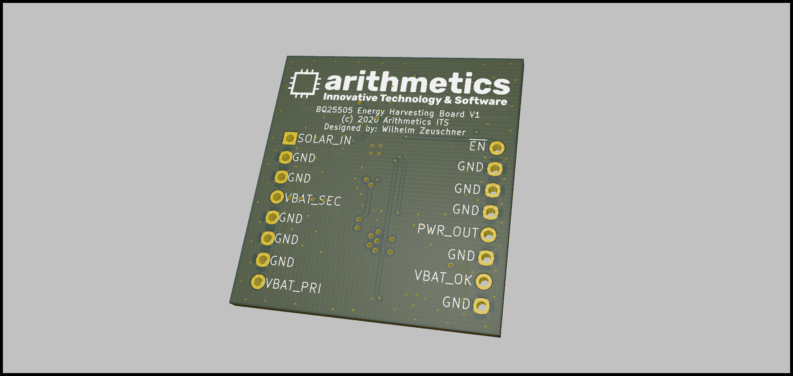

# Breakout Board: BQ25505 ultra low-power energy harvester with battery management and autonomous power multiplexing
## Description

The bq25505 device is specifically designed to efficiently extract the microwatts (μW) to miliwatts (mW) of power generated from a variety of DC energy harvesting, high-impedance sources like photovoltaic (solar) or thermal electric generators (TEGs) without collapsing those sources. The batterymanagement features of the bq25505 ensure that a secondary rechargeable battery is not overcharged by this extracted power, with voltage boosted, nor depleted beyond safe limits by a system load. The
integrated multiplexer gate drivers autonomously switch the system load to a primary nonrechargeable battery if the secondary battery voltage falls below the user-defined VBAT_OK threshold.

## Features

- Texas Instruments BQ25505
- Designed for solar applications with MPPT
- 2x Dual, P-Channel, ChipFET 20 V, 4.1 A for primary and secondary battery switching
- 2x LEDs to visualize the currently used battery (PRI or SEC)

